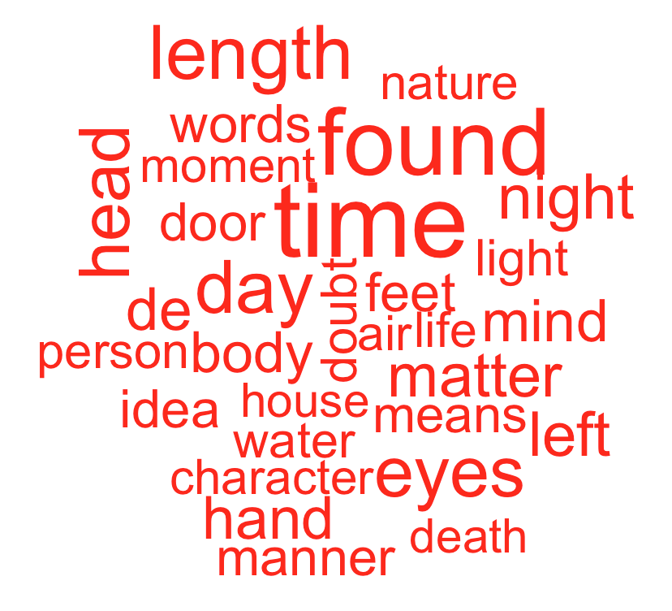
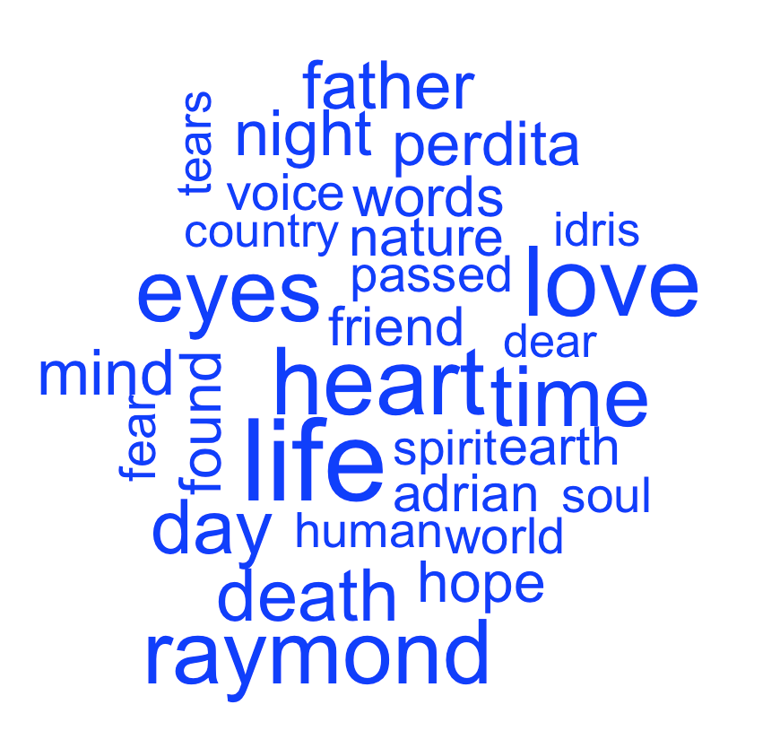
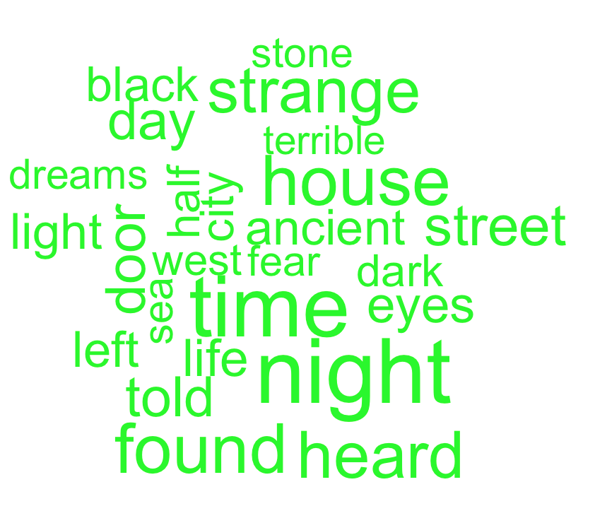
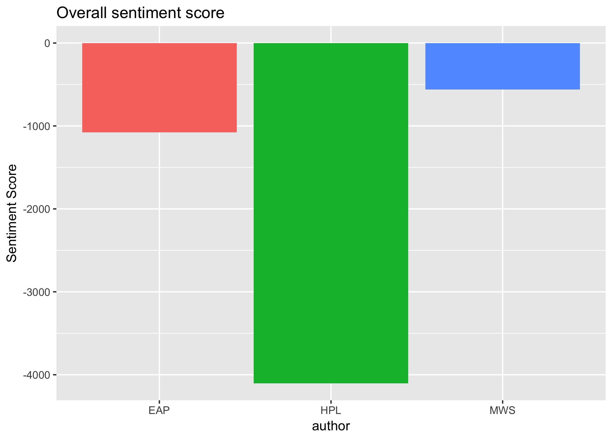
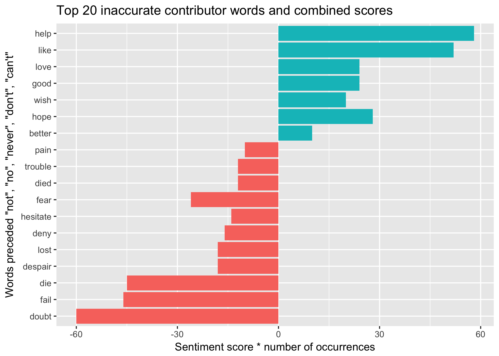
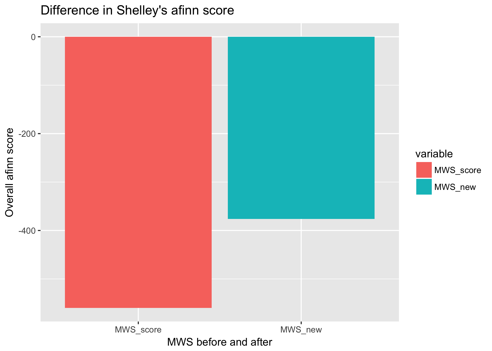

# Spooky Text Analysis: 
# 1st Place for spooky goes to Lovecraft (and more)

*This is a project I developed for Spring 2018 STAT4243 Applied Data Science at Columbia University.* 

Edgar Allan Poe, Mary Wollstonecraft Shelley, and H.P. Lovecraft are famous for their tales of mystery and horror. The files contain my investigation of the authors' texts using various text mining approaches, including sentiment analysis and character exploration. 

I first prepare the data by using the unnest_token() function to break up sentences into words, remove punctuations, and transform all words into lower case. I am also removing stop words such as “and” and “of” that are not pertinent to my initial investigation. Then, I began my exploratory data analysis that analyzed sentence attributions and word frequencies. The 30 most common words that surface from each author's text are organized in a word cloud, starting with Poe in red, followed by Mary Shelley in blue, then Lovecraft in green. 

The three distinct patterns that surfaced from the word frequency analysis inspired me to conduct sentiment analysis, in order to find out if these themes indeed map back to the entire narrative.

### Sentiment Analysis with Words 

I look beyond the mere frequency of terms to analyze sentiment associated with each author’s text. Out of the three sentiment lexicons (nrc, bing, and AFINN), I will be using AFINN. AFINN assigns words with a score between -5 and 5, with -5 at the negative end of the spectrum and 5 at the positive end.

The overall afinn scores are as I initially predicted: Lovecraft boasts a significantly lower score than Poe and Shelley. These, however, are only net scores. It would be interesting to see the changes in sentiment and tone throughout the trajectory of each narrative. I divided the text into sections of 100 lines of text after testing out 1000 and 500 lines. Looking at sentiment per 100 lines of text presented the clearest and most transparent look at sentiment changes in each author’s text.

Word-level sentiment analysis presented the overall sentiment scores as well as changes in sentiment throughout the trajectory of each author's narrative. Lovecraft's text champions negativity, which is heartily maintained throughout his entire narrative. Mary Shelley's text, while the most positive in nature, exhibits extremes, indicating greater fluctations between positive and negative moods, while Poe's is relatively stable. 

### A Re-investigation of Sentiment with Bigrams

A bi-gram sentiment analysis was then performed to correct for the possibility of negating words making erroneous contributions to the sentiment score. For example, the scores of words preceded by negating words like "never" and "not" should be reversed. I identified 286 bigrams that may have made erroneous contributions to the initial sentiment analysis. 

Below is an example of how Mary Shelley's sentiment score changed when incorporationg the results of the bi-gram analysis into the original sentiment score. 

In conclusion, conducting an n-gram analysis can shed light on information that a word-level analysis may miss. In this case, the n-gram sentiment analysis made Lovecraft’s score more negative, while making Poe’s and Shelley’s scores more positive. Lovecraft’s text remains the most negative, surpassing Poe ’sby approximately 3300 points and Shelley by 3600 points.

### Characters and Gender Roles & Biases

Finally, for my last chunk of analysis, I examined the role that gender may play in each author's text, by way of ratio of "significant" female and male characters, defined as those whose names are mentioned 20+ times in the text. I used "openNLP" and "NLP" packages to isolate proper nouns and thus names of characters to conduct this analysis. The results demonstrated that Shelley's text had more "significant" female characters than male characters, while Poe and Lovecraft had very few if any "significant" female characters that were distinguishable based on name alone. 

The above results inspired me to further explore how Shelley's characters' development, roles, and personalities may differ based on gender. I chose Raymond and Perdita as subjects for this additional analysis; by isolating words that follow the mention of Raymond and Perdita's names, I deduced that Perdita may exhibit more subdued and docile tendencies than Raymond. 

Some additional strategies to further investigate the role that gender may play in narrative and character development include studying the types of words that succeed pronouns such as "he" and "she". 

